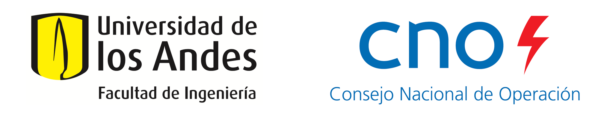

# cnosolar


 
## Introducción
---

#### Acuerdo Específico 5: Convenio Marco CNO-Uniandes

Desarrollo de los protocolos para el cálculo de la CEN (Capacidad Efectiva Neta) y el modelo que relaciona el recurso y la potencia para plantas solares fotovoltaicas a partir de modelamiento computacional, de acuerdo con la Resolución CREG 201 de 2017, los Acuerdos CNO correspondientes y la demás reglamentación aplicable.

#### Objetivos
1. Metodología para la estimación y modelamiento de la Irradiancia Normal Directa (*Direct Normal Irradiance* – DNI), la Irradiancia Horizontal Difusa (*Diffuse Horizontal Irradiance* – DHI) y la irradiancia sobre el plano del arreglo (*Plane-of-Array* - POA) a partir de la Irradiancia Horizontal Global (*Global Horizontal Irradiance* – GHI).
2. Protocolo para el cálculo de la CEN de plantas solares fotovoltaicas antes de su entrada en operación.
3. Protocolo al modelo que relaciona el recurso y la potencia en plantas solares fotovoltaicas. El modelo permitirá obtener la producción de la planta a partir de los parámetros técnicos de la planta (configuración, tecnologías, tipo de seguimiento, entre otros aspectos), la irradiancia y otras variables meteorológicas.

## Instalación
---

#### Distribución y Ambiente
Se recomienda instalar [Anaconda](https://www.anaconda.com/products/individual) o [Miniconda](https://docs.conda.io/en/latest/miniconda.html) e instalar las librerías necesarias dentro de un ambiente específico para este software. 

Anaconda es una distribución de Python con muchas librerías necesarias para computación científica o ciencia de datos. Miniconda es una distribución básica y más recomendada en sistemas con limitación de recursos.

Luego de descargar e instalar la distribución de su elección, inicie el terminal. Si la instalación se realizó de manera correcta, debe estar en el ambiente `(base)`. 

Ahora se puede crear un ambiente específico para PVlib y los demás requerimientos de este sofware, dispuestos en el archivo `requirements.txt`. Por ejemplo, si queremos que el ambiente se llame `pvlib`:

```python
$ conda create --name pvlib
```

Ahora se activa dicho ambiente:

```python
$ conda activate pvlib
```

Después de ejecutar el comando anterior, se debe estar en el ambiente correspondiente, en este caso denotado por `(pvlib)`. Ahora se pueden instalar las librerías requeridas para correr los cuadernos así:

```python
$ conda install package-name
```

Si se desea instalar una versión específica, por ejemplo `pvlib=0.9.0`, el comando es:

```python
$ conda install pvlib==0.9.0
```

Para instalar las librerías especificadas en el archivo `requirements.txt`, por favor use una de las siguientes opciones:

```python
$ conda install --file requirements.txt
$ pip install -r requirements.txt
```

#### Widgets

La interfaz gráfica de usuario es realizada con [`ipywidgets`](https://ipywidgets.readthedocs.io/en/latest/). Esta es una librería con *widgets* HTML interactivos para Jupyter Notebook y el kernel de IPython.

En el ambiente activado, ejecute:

```python
$ conda install -c conda-forge ipywidgets
```

La mayoría de las veces, la instalación de `ipywidgets` configura automáticamente Jupyter Notebook para utilizar los *widgets*. No obstante, es posible que deba habilitar manualmente la extensión de notebook `ipywidgets` con:

```python
$ jupyter nbextension enable --py widgetsnbextension
```

#### Repositorio

Para [clonar](https://docs.github.com/es/repositories/creating-and-managing-repositories/cloning-a-repository) el repositorio `cnosolar` se recomienda usar el software [GitHub Desktop](https://desktop.github.com/). La url del repositorio es: [andresgm/cno_solar](https://github.com/andresgm/cno_solar).

Otra opción es desde el terminal con en el ambiente activado; para esto ejecute:

```python
$ git clone https://github.com/YOUR-USERNAME/YOUR-REPOSITORY
```

## License
---

MIT License, dispuesta en el archivo `LICENSE`.